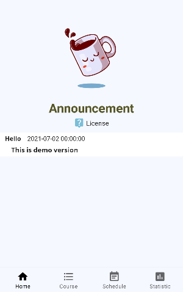

# GT-Time
Android app for georgia tech courseSchedule registration.\
Code is written in Android Studio, Java based.\

# Features
* Supports user login 
* Displays list of courseSchedule information including courseSchedule credit, courseSchedule title, courseSchedule professor, courseSchedule area obtained from official school website
* Organized schedule UI with courses added by user 

# Installation
Clone repo\
`git clone https://github.com/cshim31/application.git`

Initiate submodules\
`git submodule update --init`

This command does both cloning and initiating submodule\
`git clone --recurse-submodules https://github.com/cshim31/application.git`

# Usage

# Contributing

# License
